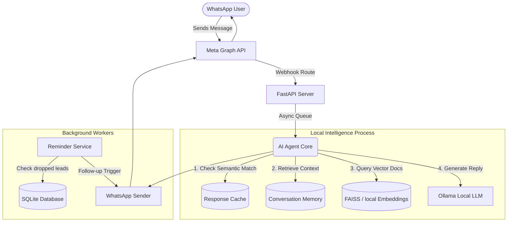

# 🤖 AI-Powered WhatsApp Business Agent 

An intelligent, autonomous WhatsApp assistant designed to automate customer interactions, lead generation, and follow-ups. Built with privacy and cost-efficiency in mind, this system leverages a **Local LLM** via Ollama, **Semantic Caching**, and asynchronous event-driven architecture to deliver seamless user experiences directly on WhatsApp.

---

## 🏗️ System Architecture

The project is built on a microservice-inspired architecture using **FastAPI**. It handles high-concurrency webhooks from the Meta Graph API, processes natural language locally, and manages stateful conversations.



---

## ✨ Core Features & Technical Highlights

### 1. 🧠 100% Local LLM Inteference (Zero API Costs)
Instead of relying on costly APIs like OpenAI, this project completely runs **locally hosted LLMs** (e.g., `qwen2.5:14b-instruct`) using [Ollama](https://ollama.com). 
* **Benefit**: Guaranteed data privacy (no customer data leaves the server) and zero recurring inference costs.

### 2. ⚡ Semantic Caching Layer
To prevent the local LLM from generating identical answers to common questions ("What courses do you offer?"), the system uses **Sentence-Transformers** (`all-MiniLM-L6-v2`) to create vector embeddings of incoming messages.
* **Benefit**: If a new question semantically matches a previously answered question (Cosine Similarity > 0.90), the system pulls from the cache, dropping response times from ~4s to **<0.1s**. 

### 3. 🚦 Asynchronous Webhook Processing
Meta strictly requires a `200 OK` response within seconds to avoid webhook retries. 
* **Implementation**: The FastAPI layer immediately acknowledges the request and offloads LLM generation and database lookups to `BackgroundTasks` via python's `asyncio` loop.

### 4. 🗄️ Stateful Conversation Memory & Lead Extraction
The agent maintains context across multiple message turns using a sliding window approach stored in SQLite. As users ask questions, the system dynamically parses intent to extract **Name, Email, and Course Interests**.
* **Benefit**: Converts casual chats into structured rows in a database, which can be easily exported to CSV.

### 5. ⏰ Automated Follow-up Service
A chron-style background loop monitors the SQLite database for users who expressed interest but stopped replying. 
* **Implementation**: Automatically triggers a polite follow-up message after a predefined interval via the Meta API to revive dead leads.

---

## 🛡️ Tech Stack Overview

| Category | Technology | Rationale / Usage |
| :--- | :--- | :--- |
| **Backend Framework** | `FastAPI`, `uvicorn` | High-performance, async-first Python framework for handling Meta Webhooks. |
| **Generative AI** | `Ollama` | Local LLM host for running 14B parameter instruction models locally. |
| **Vector / Embeddings** | `Sentence-Transformers` | Used to generate dense vectors for semantic caching and document retrieval. |
| **Database** | `SQLite` | Lightweight, zero-config relational database for handling leads and short-term conversation memory. |
| **External API** | `Meta Graph API v21.0` | Official WhatsApp Cloud API integration for sending and receiving messages. |
| **Deployment** | `Docker`, `Docker-Compose` | Containerized setup linking the Python environment natively with Ollama on the host. |

---

## 🛠️ Setup & Installation Instructions

### Prerequisites
1. **Python 3.10+**
2. **Ollama**: Download from [ollama.com](https://ollama.com).
   ```bash
   ollama pull qwen2.5:14b-instruct
   ```
3. **Meta Developer App**: Configure a WhatsApp Business App and generate an Access Token.

### 1. Clone & Install
```bash
git clone <repository_url>
cd <project_directory>

# Create virtual environment
python -m venv venv
.\venv\Scripts\activate   # Windows
# source venv/bin/activate # Mac/Linux

# Install requirements
pip install -r requirements.txt
```

### 2. Configure Environment
Rename `.env.example` to `.env` and fill in your Meta platform credentials.
```bash
WHATSAPP_VERIFY_TOKEN="your_custom_verify_token_here"
WHATSAPP_ACCESS_TOKEN="EAA8..."
WHATSAPP_PHONE_NUMBER_ID="..."
WHATSAPP_BUSINESS_ACCOUNT_ID="..."
```

### 3. Run the Server
*To run directly on the host machine:*
```bash
python main.py
```
*(Server will initialize database, warm up the model, and listen on port 8000).*

### 4. Exporting Analytics
A standalone batch script is included for business stakeholders to extract collected lead data instantly:
```bash
python export_leads.py
# Or run get_leads.bat on Windows
```

---

*This project was developed to demonstrate end-to-end expertise in modern AI engineering, asynchronous Python backends, and practical API integration.*
